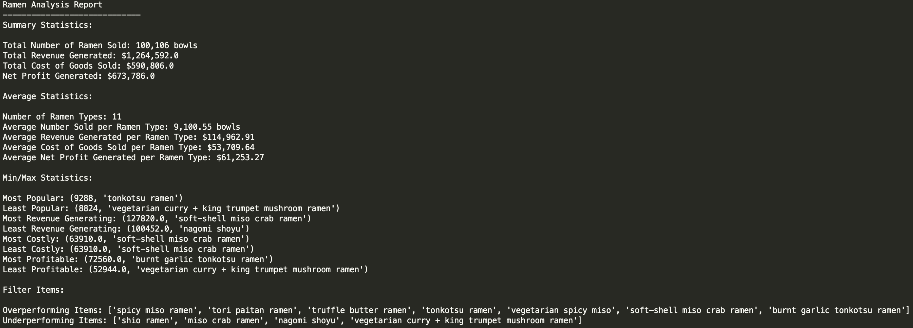

# Python Challenge
This repository contains two scrips:

## I. PyBank
Python script that analyses the records in [budget_data.csv](PyBank/Resources/budget_data.csv) to calculate:
- The total number of months included in the dataset
- The net total amount of Profit/Losses over the entire period
- The average of the changes in Profit/Losses over the entire period
- The greatest increase in profits (date and amount) over the entire period
- The greatest decrease in losses (date and amount) over the entire period

Additionally, a text file is generated [output.txt](PyBank/output.txt) with the results. The output of the script looks 
like this example:
```text
  Financial Analysis
  ----------------------------
  Total Months: 86
  Total: $38382578
  Average  Change: $-2315.12
  Greatest Increase in Profits: Feb-2012 ($1926159)
  Greatest Decrease in Profits: Sep-2013 ($-2196167)
```

## II. PyRamen
Python script to support the analysis of a business' financial performance by cross-referencing the sales data 
[sales_data.csv](PyRamen/Resources/sales_data.csv) with the internal menu data [menu_data.csv](PyRamen/Resources/menu_data.csv) 
to figure out revenues and costs for the year.

In addition, the script assesses sales by product and generates a report with each product type and the following metrics:
- Count
- Revenue
- Cogs
- Profit

The report generated by the PyRamen script will look like this example:

